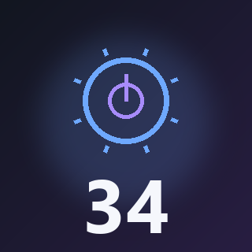

<!-- Improved compatibility of back to top link: See: https://github.com/othneildrew/Best-README-Template/pull/73 -->
<a id="readme-top"></a>

<!-- PROJECT SHIELDS -->
[![Contributors][contributors-shield]][contributors-url]
[![Forks][forks-shield]][forks-url]
[![Stargazers][stars-shield]][stars-url]
[![Issues][issues-shield]][issues-url]
[![License][license-shield]][license-url]

<!-- PROJECT LOGO -->
<br />
<div align="center">
  <a href="#about-the-project">
    
  </a>

  <h3 align="center">Vault34</h3>

  <p align="center">
    <strong>Offline media indexer for images, GIFs and videos.</strong>
    <br />
    Local tagging with WD-14, perceptual duplicate detection and a searchable gallery.
    <br />
    <br />
    No cloud. No API keys. No telemetry. After the one-time model download, it never touches the network.
  </p>
</div>

<br />

<!-- TABLE OF CONTENTS -->
<details>
  <summary>Table of Contents</summary>
  <ol>
    <li>
      <a href="#about-the-project">About The Project</a>
      <ul>
        <li><a href="#built-with">Built With</a></li>
        <li><a href="#how-it-works">How It Works</a></li>
        <li><a href="#supported-formats">Supported Formats</a></li>
        <li><a href="#api">API</a></li>
      </ul>
    </li>
    <li>
      <a href="#getting-started">Getting Started</a>
      <ul>
        <li><a href="#prerequisites">Prerequisites</a></li>
        <li><a href="#installation">Installation</a></li>
        <li><a href="#usage">Usage</a></li>
        <li><a href="#configuration">Configuration</a></li>
        <li><a href="#gpu-acceleration">GPU Acceleration</a></li>
        <li><a href="#ffmpeg-optional">FFmpeg (optional)</a></li>
      </ul>
    </li>
    <li><a href="#verification">Verification</a></li>
    <li><a href="#project-layout">Project Layout</a></li>
    <li><a href="#troubleshooting">Troubleshooting</a></li>
    <li><a href="#roadmap">Roadmap</a></li>
    <li><a href="#contributing">Contributing</a></li>
    <li><a href="#license">License</a></li>
    <li><a href="#acknowledgments">Acknowledgments</a></li>
  </ol>
</details>

<br />

<!-- ABOUT THE PROJECT -->
## About The Project

[![Vault34 Screen Shot][product-screenshot]](images/screenshot.png)

**Vault34** is a desktop application that builds a searchable local library out of a
folder of images, GIFs and videos. Drop files into the inbox and it tags them with a
neural network running entirely on your machine, works out which ones are duplicates,
generates thumbnails, and gives you a gallery you can search by tags.

The tagger is **WD-14** (`wd-v1-4-moat-tagger-v2`), the same model family used by
popular tagging front-ends, exported to ONNX. It knows **9083 labels**, including
characters, ratings and a long tail of general concepts.

Everything runs locally:

- **No cloud.** The only network access is the one-time model download in `setup_assets.py`.
- **No API keys.** Nothing to sign up for.
- **No telemetry.** The Flask server binds to `127.0.0.1` only.
- **No build step.** Python plus a few wheels, nothing to compile.

### Why

Existing tools forced a choice: send your images to a server, or accept coarse
keyword metadata. Vault34 does the tagging locally, so a private or
embarrassing library stays private, and you still get neural-net quality labels.

Duplicate detection is the other half of the problem. It hashes each file with
SHA-256 *and* with two perceptual hashes (pHash + dHash). A re-encoded video, a
resized JPEG or a screenshot of the same picture all land in `media/duplicates/`
instead of polluting the library, and the gallery tells you what each one duplicates.

<p align="right">(<a href="#readme-top">back to top</a>)</p>

### Built With

- **Python 3.14** - application core
- **ONNX Runtime** - neural inference for the tagger (CPU or CUDA)
- **WD-14 v1.4 Moat tagger** - 9083-label classifier, MIT licensed
- **SQLite + FTS5** - storage, indexes and full-text search in one file
- **Pillow** - image decoding, perceptual hashing, thumbnails
- **OpenCV** - video probing and frame extraction when ffmpeg is absent
- **watchdog** - native filesystem watching
- **Flask** - loopback JSON API
- **pywebview** - native desktop window
- **WebView2 / Chromium** - the UI

<p align="right">(<a href="#readme-top">back to top</a>)</p>

### How It Works

```
media/inbox/ ──watchdog──▶ stability check ──▶ pipeline worker ──┬─▶ media/library/
                                                                  └─▶ media/duplicates/
                                                                     media/thumbs/
                                                                         │
                                                                    SQLite + FTS5
                                                                         │
                                                                 Flask ─▶ pywebview UI
```

1. **Watch.** `watchdog` fires the instant a directory entry changes, which is too
   early - a file being copied in is not finished. So the handler only *schedules*
   the path; a background thread waits until size and mtime stop changing (3
   consecutive polls, 0.5 s apart) before handing it to the pipeline. A slow tag
   never blocks the observer.
2. **Probe.** Dimensions, frame count and duration. `ffprobe` is used when
   available, otherwise OpenCV.
3. **Hash.** SHA-256 for exact duplicates, pHash + dHash for perceptual ones. Video
   gets the same treatment on its representative frame, so a re-encoded copy of a
   clip is caught even though it shares no bytes with the original.
4. **Tag.** The frame is resized to 448x448 (white padding, raw 0-255 pixels) and fed
   to the ONNX graph. Ratings and characters are split out using the category column
   of the shipped vocabulary.
5. **File away.** Unique files move to `media/library/`, duplicates to
   `media/duplicates/` with a pointer to the item they duplicate.
6. **Index.** Rows in `media`, tags in normalised tables, text in an FTS5 table for
   filename and tag search.

Ingest runs on a single worker thread, so a slow file cannot stall the UI, and the
progress bar always reflects real work in flight rather than just queue depth.

<p align="right">(<a href="#readme-top">back to top</a>)</p>

### Supported Formats

| Type | Extensions |
|---|---|
| Images | `.jpg` `.jpeg` `.png` `.webp` `.gif` `.bmp` `.tif` `.tiff` `.avif` `.jxl` |
| Video | `.mp4` `.webm` `.mov` `.avi` `.mkv` `.m4v` `.wmv` `.flv` `.mpg` `.mpeg` `.ts` |

Animated files (`.gif`, `.webp`) are flagged as such and get a still thumbnail.

<p align="right">(<a href="#readme-top">back to top</a>)</p>

### API

The Flask server is bound to `127.0.0.1` and files are served **by media id, never by
a client-supplied path**, so a stray request cannot read arbitrary files off the
machine.

| Method | Route | Purpose |
|---|---|---|
| `GET` | `/api/stats` | totals, byte count, live progress |
| `GET` | `/api/status` | model state, providers, thresholds, paths |
| `GET` | `/api/search` | `q`, `tag`, `kind`, `min_confidence`, `sort`, `limit`, `offset` |
| `GET` | `/api/tags/autocomplete` | tag suggestions by usage |
| `GET` | `/api/tags/top` | most-used tags |
| `GET` | `/api/tags/related` | co-occurring tags |
| `GET` | `/api/media/<id>` | full record with tags |
| `GET` | `/api/media/<id>/thumb` | JPEG thumbnail |
| `GET` | `/api/media/<id>/file` | original bytes |
| `GET` | `/api/duplicates` | groups of duplicate files |
| `GET` | `/api/progress` | current phase and item |
| `POST` | `/api/scan` | queue everything in the inbox |
| `POST` | `/api/ingest` | queue a folder (`{"folder": "..."}`) or the inbox |

Tags combine with AND: `?q=sunset+landscape` returns items carrying both.
Free text matches filenames and tags through FTS5.

<p align="right">(<a href="#readme-top">back to top</a>)</p>

<br />

<!-- GETTING STARTED -->
## Getting Started

### Prerequisites

- **Python 3.11+** (developed and verified on 3.14)
- ~1 GB of free disk for the model and thumbnails
- Optionally **ffmpeg** on `PATH` for better video support - Vault34 works without it

### Installation

1. **Install dependencies**

   ```sh
   git clone https://github.com/your_username/vault34.git
   cd vault34
   python -m pip install -r requirements.txt
   ```

2. **Fetch the model** (one-time, ~326 MB, the only step that uses the network)

   ```sh
   python setup_assets.py
   ```

   This downloads `wd14.onnx` and `selected_tags.csv` into `models/`. To confirm the
   download is valid before you ever start the app:

   ```sh
   python setup_assets.py --check
   ```

   `--check` inspects the ONNX graph, verifies the input tensor is NHWC `448x448`
   with raw 0-255 pixels, confirms the vocabulary has 9083 entries, and runs a real
   inference. If it prints a pass, tagging will work.

3. **Run it**

   ```sh
   python main.py
   ```

4. **Add media.** Drop files into `media/inbox/`. The watcher notices them, waits
   until they stop changing, tags them, and files them into the library. Or press
   **Rescan inbox** in the sidebar.

   Headless / no-window mode, useful for a quick check:

   ```sh
   python main.py --headless
   ```

<p align="right">(<a href="#readme-top">back to top</a>)</p>

### Usage

1. Drop files into `media/inbox/`.
2. Watch the progress bar at the bottom while they are tagged.
3. Search by typing: `sunset landscape` finds items with both tags, plain words match
   filenames.
4. Click a thumbnail to open the lightbox, with full metadata, tags and a
   **Show in folder** button.
5. Switch to the **Duplicates** tab to review what was detected and why - each entry
   records whether it was an exact or a perceptual match, and points at its original.

<p align="right">(<a href="#readme-top">back to top</a>)</p>

### Configuration

Every path derives from the project root, so the whole folder can be moved or renamed
without breaking anything. Override defaults with environment variables (prefix
`VAULT34_`) or by editing `config.json` in the project root:

| Setting | Default | Meaning |
|---|---|---|
| `general_threshold` | `0.35` | minimum confidence for a general tag |
| `character_threshold` | `0.40` | higher, because character false-positives are noisy |
| `max_tags` | `60` | cap on tags kept per item |
| `max_phash_distance` | `4` | Hamming tolerance for perceptual matches |
| `max_dhash_distance` | `6` | secondary check, deliberately looser |
| `thumb_size` | `480` | longest thumbnail edge, in pixels |
| `stability_checks` | `3` | polls a file must be unchanged before ingest |
| `stability_interval` | `0.5` | seconds between those polls |
| `organize` | `true` | move files out of the inbox into the library |
| `host` | `127.0.0.1` | API bind address |
| `port` | `8734` | API port |
| `ffmpeg_path` | auto-detected | explicit path to the ffmpeg binary |
| `providers` | `[]` | ONNX execution providers |

```sh
VAULT34_PORT=9000 VAULT34_PROVIDERS=CUDAExecutionProvider python main.py
```

Tighten or loosen duplicate detection without touching code:

```sh
VAULT34_MAX_PHASH_DISTANCE=2 VAULT34_MAX_DHASH_DISTANCE=3 python main.py
```

Changing the inbox or library folder from the UI writes to `config.json` and restarts
the watcher against the new location.

<p align="right">(<a href="#readme-top">back to top</a>)</p>

### GPU Acceleration

`onnxruntime` defaults to CPU. For NVIDIA CUDA:

```sh
python -m pip uninstall -y onnxruntime
python -m pip install onnxruntime-gpu
```

Then set `VAULT34_PROVIDERS=CUDAExecutionProvider,CPUExecutionProvider`. The app
prints the active providers at startup and falls back to CPU if the requested one is
unavailable, so a wrong setting degrades instead of crashing.

<p align="right">(<a href="#readme-top">back to top</a>)</p>

### FFmpeg (optional)

Videos work without ffmpeg - OpenCV handles probing and frame extraction. Installing
ffmpeg gives you broader codec coverage and faster, more accurate thumbnails. Put it
on `PATH` or point at it with `VAULT34_FFMPEG_PATH`.

<p align="right">(<a href="#readme-top">back to top</a>)</p>

<br />

<!-- VERIFICATION -->
## Verification

Four suites cover the paths that are easy to get quietly wrong. They are real tests
against real files, not mocks.

```sh
python verify_pipeline.py   # ingest, tagging, dedup, file placement, search, thumbs
python verify_api.py        # every HTTP route, plus a live watcher drop
python verify_misc.py       # config persistence, desktop bridge, matcher rebuild
python verify_ui.py         # overlay visibility and the hidden-attribute cascade
```

A few of these exist because they caught an actual bug:

- **`file placement`** asserts that every database row points at a file that really
  moved out of the inbox. An inverted `Path.replace()` once left `library/` empty
  while every row claimed a file that did not exist, and no amount of database
  assertions had noticed.
- **A re-encoded video** is included on purpose: it shares no bytes with its source
  and is a different resolution, so only frame hashing catches it.
- **A slow write** is written in chunks with delays, proving the watcher waits for a
  file to stop changing before touching it.
- **`verify_ui.py`** guards a subtle CSS trap: the `hidden` attribute is only a
  browser-default rule, so any author rule setting `display` silently defeats it. That
  shipped as a full-screen lightbox permanently stuck on top of the app with a
  non-functional close button.

> [!NOTE]
> `verify_pipeline.py` **resets the database** and rebuilds a synthetic inbox. Run it
> on a scratch copy if you have real data indexed.

<p align="right">(<a href="#readme-top">back to top</a>)</p>

<br />

<!-- PROJECT LAYOUT -->
## Project Layout

```
vault34/
├── main.py               entry point, desktop bridge, lifecycle
├── setup_assets.py       one-time model download + validation
├── make_readme_assets.py generates images/logo.png and the sample content
├── verify_*.py           the four verification suites
├── vault34/
│   ├── config.py         paths, thresholds, env / config.json overrides
│   ├── db.py             schema, FTS5, search, duplicate queries
│   ├── tagger.py         WD-14 ONNX inference
│   ├── hashing.py        sha256, phash, dhash, DuplicateMatcher
│   ├── media.py          classify, probe, thumbnail, frame extraction
│   ├── pipeline.py       single ingest worker
│   ├── watcher.py        watchdog + file-stability settling
│   └── server.py         Flask API, static hosting
├── web/                  index.html, app.js, style.css
├── images/               logo.png, screenshot.png
├── models/               wd14.onnx, selected_tags.csv   (downloaded)
├── media/                inbox, library, duplicates, thumbs
└── vault34.db            SQLite database
```

<p align="right">(<a href="#readme-top">back to top</a>)</p>

<br />

<!-- TROUBLESHOOTING -->
## Troubleshooting

| Symptom | Cause and fix |
|---|---|
| `[tagger] model missing` | run `python setup_assets.py` |
| `port 8734 is already in use` | another instance is running, or set `VAULT34_PORT` |
| `ffmpeg not found` | harmless - OpenCV handles video |
| Files sit in the inbox | a file is still being written; check `last_error` in `/api/stats` |
| An item has no tags | it indexed but inference failed; `last_error` says why |
| Nothing appears after copying | press **Rescan inbox**, or check the console for `[watch]` |
| A window will not open | open the printed URL in a browser; everything but *reveal in Explorer* works |
| Duplicates are missed | lower `VAULT34_MAX_PHASH_DISTANCE` (at the cost of false positives) |

<p align="right">(<a href="#readme-top">back to top</a>)</p>

<br />

<!-- ROADMAP -->
## Roadmap

- [x] Offline WD-14 tagging for images, GIFs and video
- [x] SHA-256 + pHash + dHash duplicate detection, including re-encoded video
- [x] FTS5 search, tag autocomplete and co-occurrence suggestions
- [x] Native window via pywebview with a browser fallback
- [x] Four verification suites
- [ ] Configurable tag presets (general / danbooru / e621 style vocabularies)
- [ ] Face-region detection so character tags can be weighted per region
- [ ] Optional CLIP-style embeddings for "find something like this"
- [ ] Sidecar `.json` export for interoperability with other tools
- [ ] Multi-language UI

<p align="right">(<a href="#readme-top">back to top</a>)</p>

<br />

<!-- CONTRIBUTING -->
## Contributing

Contributions are welcome. A few things that will help:

- **Keep it offline.** No feature may require a network call at runtime. If it needs
  a model or data, fetch it once through `setup_assets.py`.
- **Add a check to a verification suite** for anything you fix. Every significant bug
  in this project was found by a test that asserted a real property of the system -
  on disk, in the database, or computed in a browser - rather than by inspection.
- **Do not raise the test bar by weakening it.** If a check is wrong, say why in the
  commit message.

1. Fork the project
2. Create your feature branch (`git checkout -b feature/AmazingFeature`)
3. Commit your changes (`git commit -m 'Add some AmazingFeature'`)
4. Push to the branch (`git push origin feature/AmazingFeature`)
5. Open a pull request

<p align="right">(<a href="#readme-top">back to top</a>)</p>

<br />

<!-- LICENSE -->
## License

Distributed under the MIT License. See `LICENSE.txt` for more information.

The bundled tagger, [WD-14 v1.4 Moat](https://huggingface.co/SmilingWolf/wd-v1-4-moat-tagger-v2),
is MIT licensed and is downloaded separately by `setup_assets.py`, not vendored into
this repository.

<p align="right">(<a href="#readme-top">back to top</a>)</p>

<br />

<!-- ACKNOWLEDGMENTS -->
## Acknowledgments

- [SmilingWolf](https://huggingface.co/SmilingWolf) for the WD-14 tagger and its
  vocabulary - this project would not exist without it
- [ONNX Runtime](https://onnxruntime.ai/) for making local inference practical
- [watchdog](https://pythonhosted.org/watchdog/) for reliable filesystem events
- [SQLite](https://sqlite.org/fts5.html) and FTS5 for search in a single file
- [Best-README-Template](https://github.com/othneildrew/Best-README-Template), which
  this README is based on
- [Img Shields](https://shields.io) for the badges above
- Everyone who files an issue with a real file that misbehaves

<p align="right">(<a href="#readme-top">back to top</a>)</p>

<br />

<!-- MARKDOWN LINKS & IMAGES -->
[contributors-shield]: https://img.shields.io/github/contributors/your_username/vault34.svg?style=for-the-badge
[contributors-url]: https://github.com/your_username/vault34/graphs/contributors
[forks-shield]: https://img.shields.io/github/forks/your_username/vault34.svg?style=for-the-badge
[forks-url]: https://github.com/your_username/vault34/network/members
[stars-shield]: https://img.shields.io/github/stars/your_username/vault34.svg?style=for-the-badge
[stars-url]: https://github.com/your_username/vault34/stargazers
[issues-shield]: https://img.shields.io/github/issues/your_username/vault34.svg?style=for-the-badge
[issues-url]: https://github.com/your_username/vault34/issues
[license-shield]: https://img.shields.io/github/license/your_username/vault34.svg?style=for-the-badge
[license-url]: https://github.com/your_username/vault34/blob/main/LICENSE.txt
[product-screenshot]: images/screenshot.png
